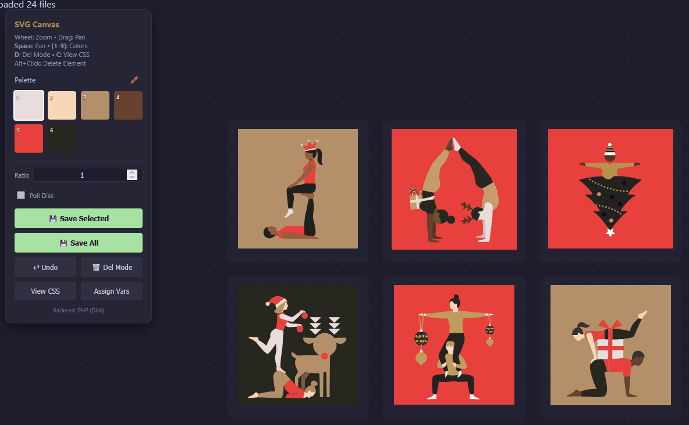

# SVG Colorizer

A tool to apply a color palette to multiple SVGs.
Adds real fill & CSS-classes so yo u can:

- Still edit the svgs later with a graphics editor like Illustrator
- Change colors on the fly in the browser (via. CSS-variables or classes)
- ⚠️ Always create a backup of your svgs before using this

## Features

- Infinite Canvas (Pan/Zoom)
- CSS Variable based coloring
- Fix Aspect Ratio
- Works with your local filesystem (you need to install PHP for that) or just use it in Browser (LocalStorage)



## Usage

1. ### Local Mode

Allows saving files directly to disk. Ensure you have PHP installed.

- Run the server (in the current dir): ``` php -S localhost:8080 ```
- Open http://localhost:8080 in your browser.
- Put your SVGs in the svgs/ folder.
- Define/Load palette -> start coloring

2. ### Browser Mode (GitHub Pages)

- No backend required. Changes are saved to Browser LocalStorage.
- Upload files to any static host (GitHub Pages, Netlify).
- Open index.html
- Use here (todo, insert link once repo published)

## Tips

Use [svgo](https://github.com/svg/svgo) to optimize a bunch of svgs.  

```bash
# optimize svgs
npm install -g svgo
svgo -f svgs svgso
```

